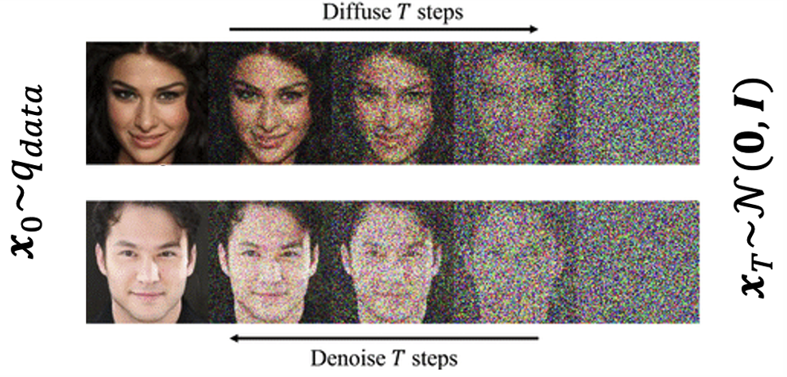

# DDPM with Hugging Face Diffusers

  

## Introduction

This project is a hands-on guide to understanding and training **Denoising Diffusion Probabilistic Models (DDPM)** using the [HugginFace Diffusers](https://huggingface.co/docs/diffusers) library.  
Through an interactive notebook, we implement step by step the main components of a diffusion model, from data preparation to generating new images.
Original paper [Denoising Diffusion Probabilistic Models](https://arxiv.org/pdf/2006.11239).

## What you will learn

- The inner workings of diffusion models, specifically **DDPM**.  
- How to prepare image datasets and apply noise using a **scheduler**.  
- How to build a **U-Net** model adapted for noise prediction.  
- Implementing the **training loop** from scratch.  
- Using Hugging Face pipelines for **image sampling**.  
- Comparing **DDPM** and **DDIM** sampling methods in terms of speed and quality.  

##  Technologies

- [PyTorch](https://pytorch.org/)  
- [Hugging Face Diffusers](https://huggingface.co/docs/diffusers)  
- [Datasets](https://huggingface.co/docs/datasets)  
- [Torchvision](https://pytorch.org/vision/stable/index.html)  

## Repository Structure

- `Jupyternotebook.ipynb` → main notebook with the full workflow.  
- `DDPM_image.png` → illustration of the diffusion process.  
- `Unet_arq.png` → diagram of the U-Net architecture used.  

## Install the required dependencies:

pip install -U diffusers datasets transformers accelerate ftfy pyarrow
